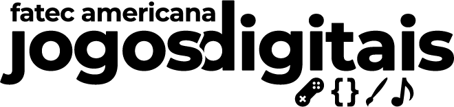
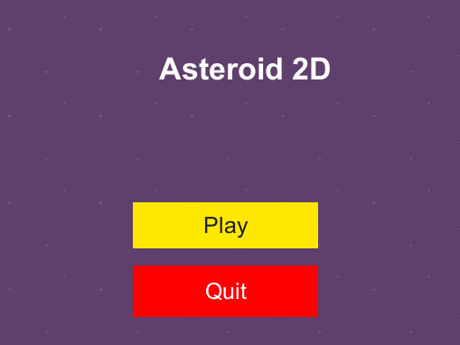
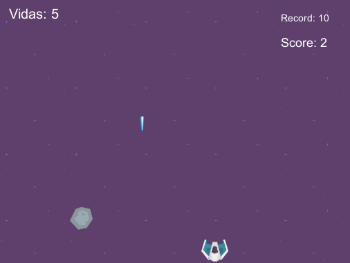

<h5 align="center">
  <br><br>
  <b>Asteroid Game</b> :ringed_planet:
</h5>
<p align="center">
  
  
</p>

### Overview

  
  
<br/>

### :scroll: About

It is a simple game inspired by Asteroids, a space-themed multidirectional shooter arcade game, where you control a space and destroy asteroid with your shots.
<br/>


## :bricks: This project was built with: 
- [Unity](https://unity.com/)

## :recycle: Contribute
 1. Fork this repository;
 2. Create a branch with your feature: ```git checkout -b my-feature```
 3. Commit your changes: ```git commit -m 'feat: My new feature'```
 4. Push your branch: ```git push origin my-feature```
 
## :page_with_curl:	License
This project is under the MIT license. Take a look at the [LICENSE](LICENSE.md) file for more details.
